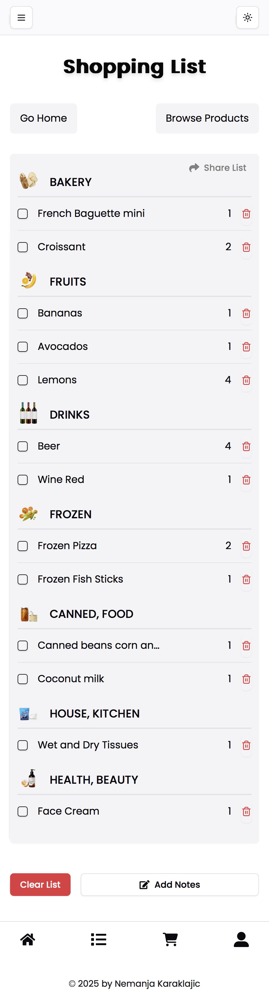
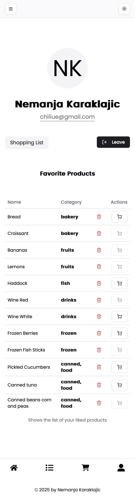
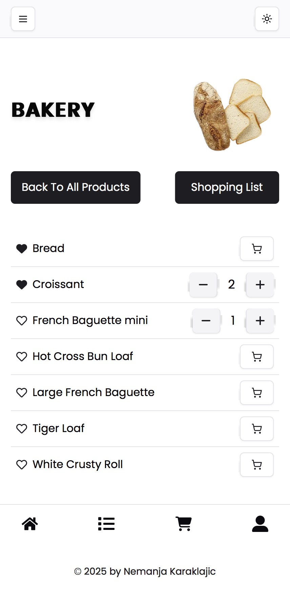
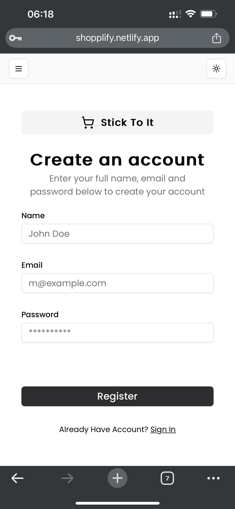
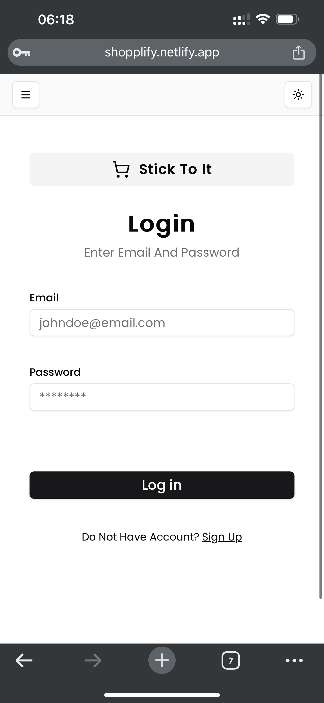

# STICK TO IT

## Overview

Stick To It app is a fully responsive web application designed to function seamlessly on both desktop and mobile
devices, mimicking a native mobile app experience. This application allows users to browse products, add them to a
shopping list, and manage their selections with ease. Designed, developed, and maintained entirely by myself, this
project aims to provide a straightforward and efficient shopping experience.

### Features

- Responsive design that works on desktop and mobile devices.
- Users can create accounts to manage their shopping lists.
- Products are organized by categories for easy browsing.
- Interactive list management including quantity and unit of measure adjustments.
- Theme—choose between light/dark theme or set it to "system" so it matches the current system theme status.

## Technology Stack

This project is built using the following technologies:

- **React.js:** A JavaScript library for building user interfaces.
- **Next.js:** A React framework for server-side rendering and generating static websites.
- **Tailwind CSS:** A utility-first CSS framework for rapidly building custom designs.
- **TypeScript** For type safety
- **MongoDB:** A NoSQL database used to store application data.

- **Authentication:**

    - **Google OAuth:** For handling user authentication through Google accounts.
    - **Credentials:** For handling user authentication through created username and password

- **Development Tools:**
    - **npm:** A package manager that doubles down as project manager.
    - **Vercel:** For deploying and hosting Next.js applications.

## Screenshots

### Web application


### Google performance rating


### Mobile devices

| Home Page | Shopping List | Profile Page |
|-----------|--------------|-------------|
|  |  |  |

| Categories Page | Login Page | Register Page |
|----------------|-----------|--------------|
|  |  |  |


## User Flow

1. **Browse Categories:**

    - Users start on the Categories Page where they can browse all available categories.

2. **View Products:**

    - By clicking on a category, users are redirected to `categories/[slug]` where they can see all products within that
      category.

3. **Add Products:**

    - Users add products to their list by clicking the "Cart" button next to each product.
    - Upon clicking "Add", options for adjusting the quantity, and an increase/decrease button are displayed.
    - After selecting the desired quantity.
    - Users can add product(s) to list of favorites by clicking the like button (empty heart icon -> full-filled heart icon)

4. **Manage Shopping List:**

    - The List Page displays all items users have added. Here, users can modify quantities, mark items
      as checked, delete products, or clear the entire list.
    - Also, users can write own notes (additional stuff)

5. **User Registration and Login:**
    - To add or manage items in the shopping list, users must register or log in.
    - Without an account, browsing categories and products is possible, but adding products and list manipulation are
      restricted.

## Technical Setup

### Prerequisites

To run this application locally, you need to have `npm` installed on your machine. For those new to npm, please refer
to [npm's official documentation](https://docs.npmjs.com/) for installation instructions.

### Environment Setup

Copy the `env.example` file to `.env.local` and update it with your specific variables:

- `NEXT_PUBLIC_DOMAIN={YOUR_DOMAIN}`
- `NEXT_PUBLIC_API_DOMAIN={YOUR_DOMAIN/api}`
- `MONGODB_URI={mongodb+srv://<name>:<password>@stick-to-it.oiewvws.mongodb.net/appdb?retryWrites=true&w=majority&appName=<app_name>}`
- `SESSION_SECRET={your_secret_key (openssl rand -base64 32)}`

### Running the Application

- **Development Mode:**

  ```bash
  npm run dev
  ```

- **Build the Application:**

  ```bash
  npm run build
  ```

- **Start the Built Application:**
  ```bash
  npm run start
  ```

Contributions
As the sole designer and developer, I welcome any feedback or contributions to the project. If you have suggestions or
encounter any issues, please feel free to open an issue or submit a pull request.

License
MIT License
